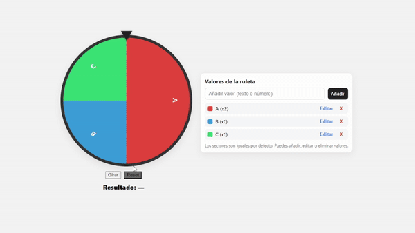

# Ruleta Simple

Una ruleta hecha con **HTML, CSS y JavaScript puro**.  
Permite añadir, editar o eliminar valores de manera sencilla, y al pulsar el botón **Girar** la ruleta rota varias vueltas hasta detenerse en un valor aleatorio.

## Características
- Sectores generados automáticamente según el número de valores.
- Botón **Girar** con animación suave de la ruleta.
- Indicador del valor obtenido.
- Posibilidad de:
  - Añadir valores.
  - Editar valores existentes (incluyendo su probabilidad de aparición mediante pesos).
  - Eliminar valores.
- Botón **Reset** para volver a la ruleta inicial con valores `A, B, C, D`.